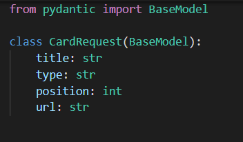

# Card Board App

This App is distributed majorly in four parts:

* Front-end
* Back-end
* Database
* Dockerizing

1) Back-end: 
- Let's start with creating our backend.
- We would use FastAPI as our backend framework.
- Let's start with configuring our env variables.

 

- Now let's create function to get db sessions.

 
- Next, we need to add models and schemas.

 

 
- Let's add router to our app now.

 
- Ok,so as we've everything set, let's run the backend with : 
```sh
  uvicorn main:app --reload --port 6969
  ```
- If we now open ```localhost:6969/docs```, we would see documentation of our backend. 

 

2) Front-end :
- React.js is used for building the front end side.
- Let's start with creating a project with command : 
 ```sh
  npx create-react-app front-end
  ```
- We are going to need following :
    * Home Page, where our cards and placeholders would be render
    * Cards, which would be movable.
    * Placeholders, where cards would be stored/located.
    * API service, to fetch and update data.
    * Modal component, to overlay image on screen when clicked.
    * Docker file, to dockerize the app.

- Our home page would be rendered in App component,that is App.js.

- Cards and Placeholders are inserted and return in App.js only.

- This is how our Home page would look in beginning (With no Cards).

  

- Now let's hit some API's to fetch our cards data

 

- We're going to write api-service which would contain all api-related functionality.

- Now as cards are loaded, our home page would look like this.

 

- Now let's add some cardswap logic.

 

 

- As almost everything is done, Let's add Image Modal to display image as overlay.

 

- Okay ! Our Front-end is ready too.

3) Let's dockerize our app.

- Let's create Dockerfile for our frontend and backend.
- For Frontend :

 

- For Backend : 

 

- Let's now create docker-compose.yml to initiate our containers : 

 


Run this command to run the App 

```sh
  docker-compose up
  ```